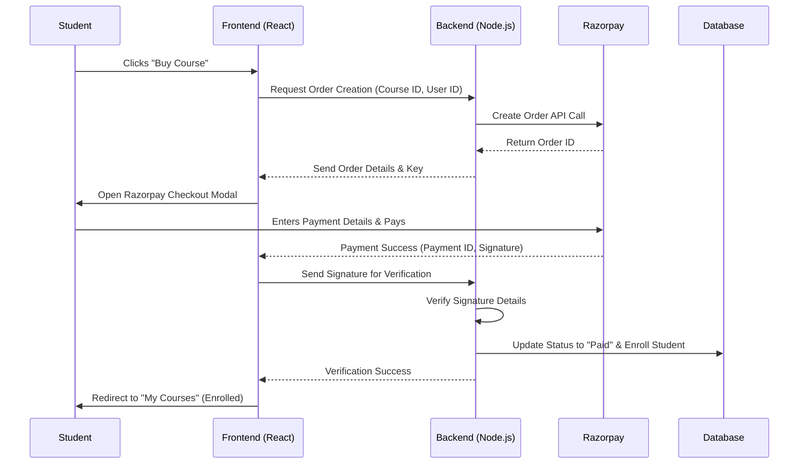
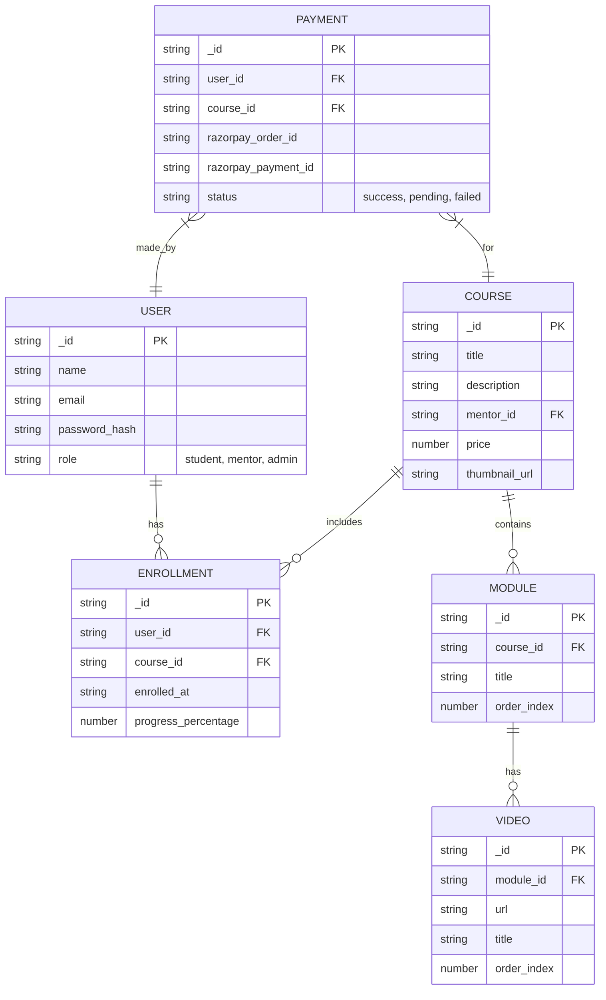
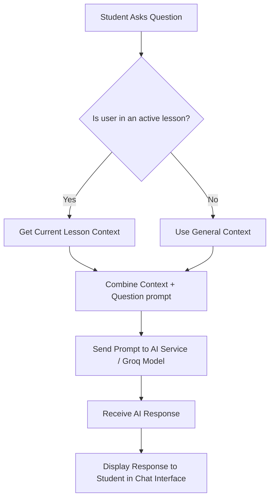

# Seedit E-Learning Platform - UML Diagrams

You can use these Mermaid UML diagrams in your project report. Many markdown editors (like GitHub, Notion, or Obsidian) support Mermaid natively. You can also paste these code blocks into [Mermaid Live Editor](https://mermaid.live/) to generate high-quality images for your Word document.

## 1. Use Case Diagram

This diagram illustrates the primary actors (Student, Mentor, Admin) and their interactions with the Seedit platform.

```mermaid
usecaseDiagram
    actor Student
    actor Mentor
    actor Admin

    package "Seedit Platform" {
        usecase "Login / Register" as UC1
        usecase "Browse Courses" as UC2
        usecase "Purchase Course (Razorpay)" as UC3
        usecase "View Enrolled Courses" as UC4
        usecase "Watch Videos Sequentially" as UC5
        usecase "Interact with AI Tutor" as UC6
        usecase "Create New Course" as UC7
        usecase "Upload Videos/Resources" as UC8
        usecase "Manage Users & Roles" as UC9
        usecase "Monitor Payments" as UC10
    }

    Student --> UC1
    Student --> UC2
    Student --> UC3
    Student --> UC4
    Student --> UC5
    Student --> UC6

    Mentor --> UC1
    Mentor --> UC7
    Mentor --> UC8
    Mentor --> UC2

    Admin --> UC1
    Admin --> UC9
    Admin --> UC10
```

## 2. Activity / Data Flow Diagram: Payment & Enrollment

This diagram shows the step-by-step flow of a student purchasing a course and getting enrolled via Razorpay.



## 3. Entity-Relationship (ER) Diagram / Class Model

This diagram outlines the core data models and their relationships within the database.



## 4. Flowchart: AI Tutor Interaction

This diagram demonstrates how the AI tutor handles a student's question based on their current lesson context.


